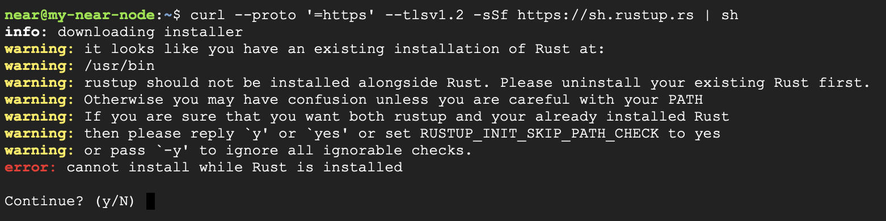
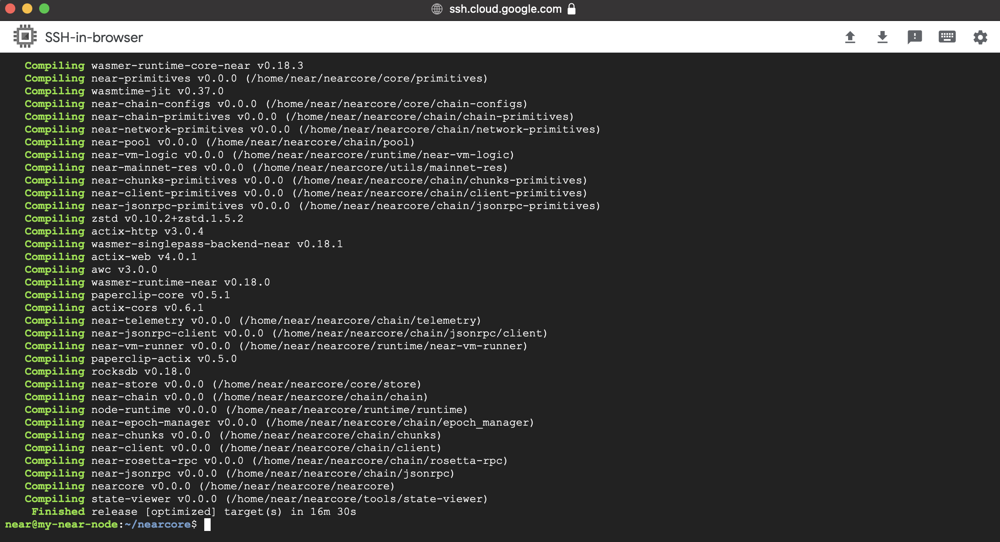

# Setting up a NEAR validator node on Google Cloud

## Prerequisites & useful links

- (required) Google Cloud account & project. If you do not have one already, please have a look at the excellent guide from Google on how to create one: https://cloud.google.com/apigee/docs/hybrid/v1.4/precog-gcpaccount
- (required) An existing wallet. For shardnet, go to wallet.shardnet.near.org and create a new one if you do not have one already.
- (optional) Discord channel for NEAR for support and useful information
- NEAR Wallet (for shardnet) https://wallet.shardnet.near.org/
- NEAR Explorer (for sharednet) https://explorer.shardnet.near.org/

## Setting up a suitable Virtual Machine

The hardware requirements for a chunk only producer is as follows:

| Hardware       | Chunk-Only Producer  Specifications                                   |
| -------------- | ---------------------------------------------------------------       |
| CPU            | 4-Core CPU with AVX support                                           |
| RAM            | 8GB DDR4                                                              |
| Storage        | 500GB SSD                                                             |

Google Cloud offers different CPU architectures and machine configurations which would be suitable for the above requirements, but for this tutorial we will select the machine type "n2-standard-4" that has 5 vCPU & 16 GB RAM and change the disk to 500 GB.

1. First go into the "Create a VM" section on the GCP
2. Add a name, e.g. "my-near-node"
3. Select a region, e.g. northamerica-northeast1 (which has low CO2 emissions) and zone northamerica-northeast-c 
4. Select machine series N2 and machine type n2-standard-4

5. Go to Boot Disk section and click Change, and change to Operating System Ubuntu, version 22.04 LTS for x86, boot disk type to SSD and size to 500 GB. Then click Select.

6. You can now also view the total pricing for the machine configuration that you selected to the right. Keep in mind this is not including networking cost, e.g. internet egress. Network pricing can be found here https://cloud.google.com/vpc/network-pricing

7. Leave the rest of the options as-is and then scroll down to the bottom of the page and click "Create". YOU WILL NOW START TO BE CHARGED by GCP for the VM (and keep in mind you will incur costs for storage even when the machine is turned off, albeit much lower than when it is running)
8. GCP will now create your VM and start it. Once it is up and running it should look like this (but with different IP addresses most likely)

9. You can log into the machine by clicking on SSH for your machine (make sure you allow popup windows)
10. This should bring up a new window where you are now into the shell of the machine.
11. Test it out by verifying that we have a CPU that fulfills the requirement of AVX extensions by running the following:

```
lscpu | grep -P '(?=.*avx )(?=.*sse4.2 )(?=.*cx16 )(?=.*popcnt )' > /dev/null \
  && echo "Supported" \
  || echo "Not supported"
```
Which should return:


## Prepare the environment for installation

1. Make sure we are up-to-date.
    ```
    sudo apt update && sudo apt upgrade -y
    ```
2. While it is not required, I recommend setting up a separate user 'near' to keep things tidy. The rest of the tutorial assumes you are logged in as user 'near'
    ```
    sudo adduser near
    sudo usermod -aG sudo near
    ```

3. Now we need to login as 'near' instead. Since we are already in the shell via the web SSH of GCP we will simply switch user. Otherwise log out and log back in with the user 'near'.

    ````
    sudo su -l near
    ````

4. Start installing what we need for NEAR. Developer tools, Node.js and npm.
    ```
    curl -sL https://deb.nodesource.com/setup_18.x | sudo -E bash -  
    sudo apt install build-essential nodejs
    PATH="$PATH"
    ```

5. Validate versions by running node -v and npm -v which should return versions 18.x.x and 8.x.x respectively.

6. Next step is to install the CLI for NEAR. Needs to be installed as root so we use sudo here.
    ```
    sudo npm install -g near-cli
    ```
7. We need to select which network to use which is done by setting the environment variable NEAR_ENV. For this tutorial we will use shardnet as it is what is used for stake wars. Add to .bashrc to make sure it gets set everytime we log in.
    ```
    export NEAR_ENV=shardnet
    echo 'export NEAR_ENV=shardnet' >> ~/.bashrc
    ```
8. Verify that all is working by running a query, e.g. ```near proposals``` which should return a list of validators that have indicated that they want to enter the validator set. Other useful commands:
    - ```near validators current``` returns all current validators and stats related to them
    - ```near validators next```returns all validators whose proposal was accepted one epoch ago, and that will enter the validator set in the next epoch.


## Install the node

Now it is time to start installing the node.

1. Install developer tools:
    ```
    sudo apt install -y git binutils-dev libcurl4-openssl-dev zlib1g-dev libdw-dev libiberty-dev cmake gcc g++ python3 docker.io protobuf-compiler libssl-dev pkg-config clang llvm cargo
    ```
2. Install Python pip:
    ```
    sudo apt install python3-pip
    ```
3. Set the configuration:
    ```
    USER_BASE_BIN=$(python3 -m site --user-base)/bin
    export PATH="$USER_BASE_BIN:$PATH"
    ```
4. Install Building env
    ```
    sudo apt install clang build-essential make
    ```
5. Install Rust & Cargo
    ```
    curl --proto '=https' --tlsv1.2 -sSf https://sh.rustup.rs | sh
    ```
    Answer Yes to continue despire the warning that rust already exists on the machine.
    

    And then select option 1 to start the installation of Rust & Cargo
6. Source the environment 
    ```
    source $HOME/.cargo/env
    ```
7. Clone `nearcore` project from GitHub. First, clone the [`nearcore` repository](https://github.com/near/nearcore).
    ```
    git clone https://github.com/near/nearcore
    cd nearcore
    git fetch
    ```
8. Checkout to the commit needed. Please refer to the commit defined in [this file](https://github.com/near/stakewars-iii/blob/main/commit.md). 
    ```
    git checkout <commit>
    ```
9. Compile `nearcore` binary. In the `nearcore` folder run the following commands:
    ```
    cargo build -p neard --release --features shardnet
    ```
    The binary path is `target/release/neard`. If you are seeing issues, it is possible that cargo command is not found. Compiling `nearcore` binary may take a little while (about 15 minutes on the machine type described in this article)

    

10. Initialize working directory. In order to work properly, the NEAR node requires a working directory and a couple of configuration files. Generate the initial required working directory by running:
    ```
    ./target/release/neard --home ~/.near init --chain-id shardnet --download-genesis
    ```

    

    This command will create the directory structure and will generate `config.json`, `node_key.json`, and `genesis.json` on the network you have passed. These files are found the `.near` folder of your home directory.

    - `config.json` - Configuration parameters which are responsive for how the node will work. The config.json contains needed information for a node to run on the network, how to communicate with peers, and how to reach consensus. Although some options are configurable. In general validators have opted to use the default config.json provided.

    - `genesis.json` - A file with all the data the network started with at genesis. This contains initial accounts, contracts, access keys, and other records which represents the initial state of the blockchain. The genesis.json file is a snapshot of the network state at a point in time. In contacts accounts, balances, active validators, and other information about the network. 

    - `node_key.json` -  A file which contains a public and private key for the node. Also includes an optional `account_id` parameter which is required to run a validator node (not covered in this doc).

    - `data/` -  A folder in which a NEAR node will write it's state.

11. From the generated `config.json`, there two parameters to modify:
    - `boot_nodes`: If you had not specify the boot nodes to use during init in Step 3, the generated `config.json` shows an empty array, so we will need to replace it with a full one specifying the boot nodes.
    - `tracked_shards`: In the generated `config.json`, this field is an empty. You will have to replace it to `"tracked_shards": [0]`
    
    To simplify things just download this version who has the changes already made

    ```
    rm ~/.near/config.json
    wget -O ~/.near/config.json https://s3-us-west-1.amazonaws.com/build.nearprotocol.com/nearcore-deploy/shardnet/config.json
    ```

## Start the node

First we need to start the node to download headers & blocks. To start your node simply run the following command:

```
cd ~/nearcore
./target/release/neard --home ~/.near run
```

The node is now running you can see log outputs in your console. Your node should be finding peers, download headers to 100%, and then download blocks.

This process takes several hours. Keep your machine on during this process.

## Activate the node as validator

1. Authorize Wallet Locally
A full access key needs to be installed locally to be able to sign transactions via NEAR-CLI. To authenticate, run this command:
    ```
    near login
    ```

2. Copy the link in your browser

    

3. Grant Access to Near CLI

    

4. After Grant, you will see an empty page or similar like "this site cannot be reached"

5. Go back to the shell and enter your wallet account id 

    

6. Now we need to create a `validator_key.json` file. Generate a key file:

    ```
    near generate-key mytestpoolname.factory.shardnet.near
    ```
    Replace `mytestpoolname` with your pool name

7. Copy the file generated to shardnet folder

    Make sure to replace `mytestpoolname` by your pool name
    ```
    cp ~/.near-credentials/shardnet/mytestpoolname.factory.shardnet.near.json ~/.near/validator_key.json
    ```

8. Edit `~/.near/validator_key.json` and change `private_key` to `secret_key`

    File content must be in the following pattern:
    ```
    {
    "account_id": "mytestpoolname.factory.shardnet.near",
    "public_key": "ed25519:HeaBJ3xLgvZacQWmEctTeUqyfSU4SDEnEwckWxd92W2G",
    "secret_key": "ed25519:****"
    }
    ```

9.  Start the validator node

    ```
    target/release/neard run
    ```

    Make sure it starts up ok and then press CTRL-C to close.

10. Setup Systemd
    Command:

    ```
    sudo vi /etc/systemd/system/neard.service
    ```
    Paste:

    ```
    [Unit]
    Description=NEARd Daemon Service

    [Service]
    Type=simple
    User=near
    #Group=near
    WorkingDirectory=/home/near/.near
    ExecStart=/home/near/nearcore/target/release/neard run
    Restart=on-failure
    RestartSec=30
    KillSignal=SIGINT
    TimeoutStopSec=45
    KillMode=mixed

    [Install]
    WantedBy=multi-user.target
    ```

    Command:

    ```
    sudo systemctl enable neard
    ```
    Command:

    ```
    sudo systemctl start neard
    ```
    If you need to make a change to service because of an error in the file. It has to be reloaded:

    ```
    sudo systemctl reload neard
    ```
    ###### Watch logs
    Command:

    ```
    journalctl -n 100 -f -u neard
    ```
    Make log output in pretty print

    Command:

    ```
    sudo apt install ccze
    ```
    View Logs with color

    Command:

    ```
    journalctl -n 100 -f -u neard | ccze -A
    ```

## Mount a staking pool

NEAR uses a staking pool factory with a whitelisted staking contract to ensure delegators’ funds are safe. In order to run a validator on NEAR, a staking pool must be deployed to a NEAR account and integrated into a NEAR validator node. Delegators must use a UI or the command line to stake to the pool. A staking pool is a smart contract that is deployed to a NEAR account.

### Deploy a Staking Pool Contract

1. Deploy a Staking Pool
    Calls the staking pool factory, creates a new staking pool with the specified name, and deploys it to the indicated accountId.

    ```
    near call factory.shardnet.near create_staking_pool '{"staking_pool_id": "<pool id>", "owner_id": "<accountId>", "stake_public_key": "<public key>", "reward_fee_fraction": {"numerator": 5, "denominator": 100}, "code_hash":"DD428g9eqLL8fWUxv8QSpVFzyHi1Qd16P8ephYCTmMSZ"}' --accountId="<accountId>" --amount=30 --gas=300000000000000
    ```
    From the example above, you need to replace:

    * **Pool ID**: Staking pool name, the factory automatically adds its name to this parameter, creating {pool_id}.{staking_pool_factory}
    Examples:   

    - If pool id is stakewars will create : `stakewars.factory.shardnet.near`

    * **Owner ID**: The SHARDNET account (i.e. stakewares.shardnet.near) that will manage the staking pool.
    * **Public Key**: The public key in your **validator_key.json** file.
    * **5**: The fee the pool will charge (e.g. in this case 5 over 100 is 5% of fees).
    * **Account Id**: The SHARDNET account deploying and signing the mount tx.  Usually the same as the Owner ID.

    > Be sure to have at least 30 NEAR available, it is the minimum required for storage.
    Example : near call stake_wars_validator.factory.shardnet.near --amount 30 --accountId stakewars.shardnet.near --gas=300000000000000

    To change the pool parameters, such as changing the amount of commission charged to 1% in the example below, use this command:
    ```
    near call <pool_name> update_reward_fee_fraction '{"reward_fee_fraction": {"numerator": 1, "denominator": 100}}' --accountId <account_id> --gas=300000000000000
    ```

**You have now configure your Staking pool.**


## Transactions Guide
##### Deposit and Stake NEAR

Command:
```
near call <staking_pool_id> deposit_and_stake --amount <amount> --accountId <accountId> --gas=300000000000000
```
##### Unstake NEAR
Amount in yoctoNEAR.

Run the following command to unstake:
```
near call <staking_pool_id> unstake '{"amount": "<amount yoctoNEAR>"}' --accountId <accountId> --gas=300000000000000
```
To unstake all you can run this one:
```
near call <staking_pool_id> unstake_all --accountId <accountId> --gas=300000000000000
```
##### Withdraw

Unstaking takes 2-3 epochs to complete, after that period you can withdraw in YoctoNEAR from pool.

Command:
```
near call <staking_pool_id> withdraw '{"amount": "<amount yoctoNEAR>"}' --accountId <accountId> --gas=300000000000000
```
Command to withdraw all:
```
near call <staking_pool_id> withdraw_all --accountId <accountId> --gas=300000000000000
```

##### Ping
A ping issues a new proposal and updates the staking balances for your delegators. A ping should be issued each epoch to keep reported rewards current.

Command:
```
near call <staking_pool_id> ping '{}' --accountId <accountId> --gas=300000000000000
```
Balances
Total Balance
Command:
```
near view <staking_pool_id> get_account_total_balance '{"account_id": "<accountId>"}'
```
##### Staked Balance
Command:
```
near view <staking_pool_id> get_account_staked_balance '{"account_id": "<accountId>"}'
```
##### Unstaked Balance
Command:
```
near view <staking_pool_id> get_account_unstaked_balance '{"account_id": "<accountId>"}'
```
##### Available for Withdrawal
You can only withdraw funds from a contract if they are unlocked.

Command:
```
near view <staking_pool_id> is_account_unstaked_balance_available '{"account_id": "<accountId>"}'
```
##### Pause / Resume Staking
###### Pause
Command:
```
near call <staking_pool_id> pause_staking '{}' --accountId <accountId>
```
###### Resume
Command:
```
near call <staking_pool_id> resume_staking '{}' --accountId <accountId>
``

## Becoming a Validator
In order to become a validator and enter the validator set, a minimum set of success criteria must be met.

* The node must be fully synced
* The `validator_key.json` must be in place
* The contract must be initialized with the public_key in `validator_key.json`
* The account_id must be set to the staking pool contract id
* There must be enough delegations to meet the minimum seat price. See the seat price [here](https://explorer.shardnet.near.org/nodes/validators).
* A proposal must be submitted by pinging the contract
* Once a proposal is accepted a validator must wait 2-3 epoch to enter the validator set
* Once in the validator set the validator must produce great than 90% of assigned blocks

Check running status of validator node. If “Validator” is showing up, your pool is selected in the current validators list.

